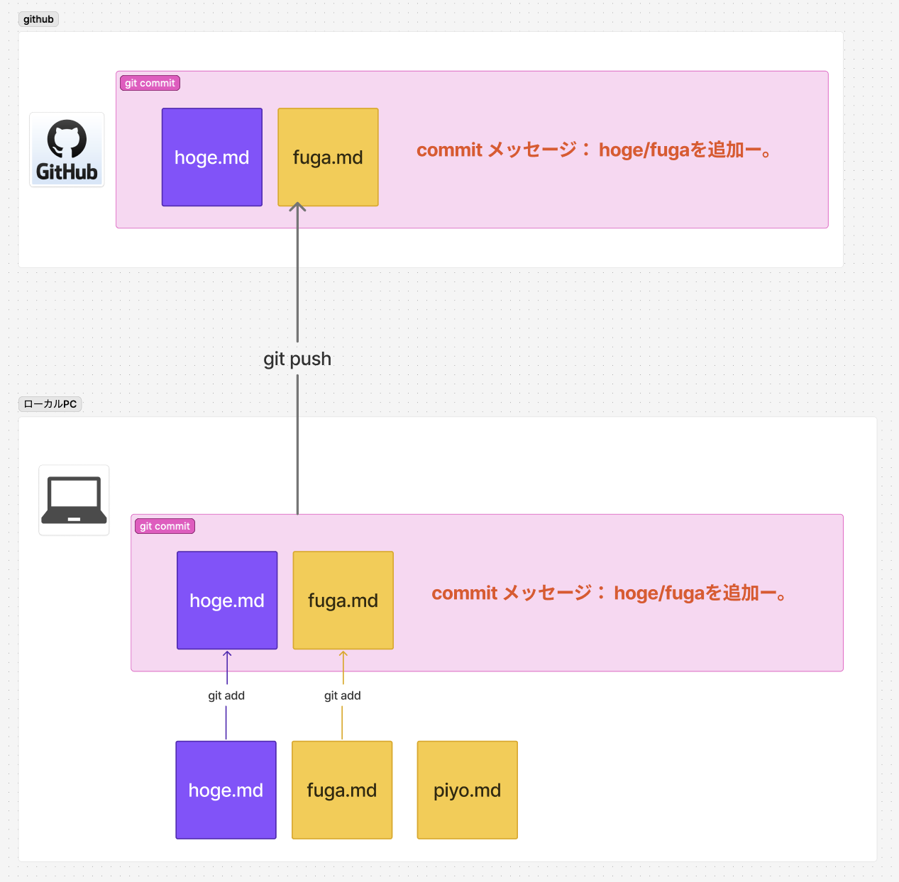

# git add
`git add`は、変更したファイルをステージングエリアに追加するコマンドです。これにより、次の`git commit`で記録される準備が整います。

### 基本的な使い方
```bash
git add <ファイル名>
```
例:
```bash
git add index.html
```


### 主なオプション
- `git add .`
  カレントディレクトリ以下のすべての変更をステージングエリアに追加します。
- `git add -p`
  変更を部分的に選択してステージングできます。

- `git add -A`
  すべてのファイルをステージングできます。

### 利用ケース
- 新しく作成したファイルや変更したファイルをコミット対象にする場合。
- 一部の変更だけを選択的にコミットしたい場合（`git add -p`を使用）。

---

# git commit
`git commit`は、ステージングエリアにある変更をローカルリポジトリに記録するコマンドです。

### 基本的な使い方
```bash
git commit -m "<コミットメッセージ>"
```
例:
```bash
git commit -m "Add new feature"
```

### 主なオプション
- `git commit --amend`
  直前のコミットを修正します。
- `git commit -a -m "<コミットメッセージ>"`
  変更されたすべてのファイルを自動的にステージングしてコミットします。

### 利用ケース
- 変更内容をローカルリポジトリに記録したい場合。
- コミットメッセージで変更内容を説明し、履歴を管理したい場合。
- 直前のコミットに漏れがあった場合（`git commit --amend`を使用）。

---

# git push
`git push`は、ローカルリポジトリの変更をリモートリポジトリに送信するコマンドです。

### 基本的な使い方
```bash
git push <リモート名> <ブランチ名>
```
例:
```bash
git push origin main
```

### 主なオプション
- `git push -u <リモート名> <ブランチ名>`
  指定したリモートとブランチをデフォルトとして設定します。
- `--force-with-lease`
  強制的にプッシュしますが、ブランチ更新日付が新しい時だけ強制します。
- `git push --force`
  強制的にプッシュします（注意: 他の人の作業を上書きする可能性があります）。

### 利用ケース
- ローカルリポジトリの変更をリモートリポジトリに反映したい場合。
- チームメンバーと変更内容を共有したい場合。
- 新しいブランチをリモートリポジトリに作成したい場合（`git push -u`を使用）。


# イメージイラスト

