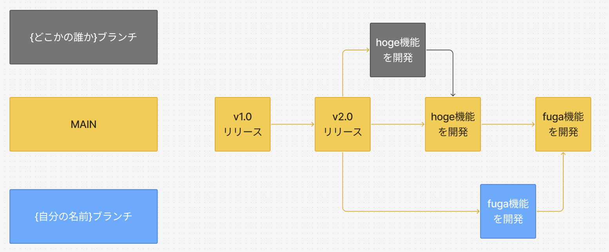

# git branch
`git branch` コマンドは、Git リポジトリ内でブランチを作成、一覧表示、削除するために使用されます。ブランチは、コードの変更を分離して作業するための仕組みで、複数の作業を並行して進める際に便利です。

機能を追加したい時、バグの修正をしたい時など、本番のブランチで作業をしてしまって、
誤ってアプリケーションに不具合を起こしてしまったら問題ですよね。
そのため、木の枝のように作業用のブランチを作成して作業していきます。




### 主なコマンド
- **ブランチの一覧表示**
  ```bash
  git branch
  ```
  現在のブランチと他のブランチを一覧表示します。

- **新しいブランチの作成**
  ```bash
  git branch <branch-name>
  ```
  新しいブランチを作成します。

- **ブランチの削除**
  ```bash
  git branch -d <branch-name>
  ```
  指定したブランチを削除します。

### オプションコマンド
- **リモートブランチの一覧表示**
  ```bash
  git branch -r
  ```
  リモートリポジトリのブランチを一覧表示します。

- **ローカルとリモートの全ブランチを一覧表示**
  ```bash
  git branch -a
  ```
  ローカルとリモートの全ブランチを一覧表示します。

- **強制的にブランチを削除**
  ```bash
  git branch -D <branch-name>
  ```
  未マージの変更がある場合でも、指定したブランチを強制的に削除します。

---

# git switch
`git switch` コマンドは、現在の作業ブランチを別のブランチに切り替えるために使用されます。`git checkout` の代替として導入され、より直感的で安全にブランチを切り替えることができます。

### 主なコマンド
- **ブランチの切り替え**
  ```bash
  git switch <branch-name>
  ```
  指定したブランチに切り替えます。

- **新しいブランチを作成して切り替え**
  ```bash
  git switch -c <branch-name>
  ```
  新しいブランチを作成し、同時にそのブランチに切り替えます。

### オプションコマンド
- **特定のコミットに基づいて新しいブランチを作成して切り替え**
  ```bash
  git switch -c <branch-name> 
  ```
  指定したコミットを基に新しいブランチを作成し、切り替えます。

---

## 利用ケース

### 1. 新しい機能を開発する場合
新しい機能を開発する際、現在のコードベースに影響を与えないように新しいブランチを作成します。
```bash
git branch feature/new-feature
git switch feature/new-feature
```

### 2. ブランチの作成と切り替えを同時に行う
git branch => git switchと2つのコマンドを打つのがめんどくさいときに利用します。
```bash
git switch -c bugfix/fix-issue
```


---

## 注意点
- ブランチを切り替える前に、現在の作業内容をコミットまたはスタッシュしておくことを推奨します。
- 不要なブランチは定期的に削除してリポジトリを整理しましょう。

