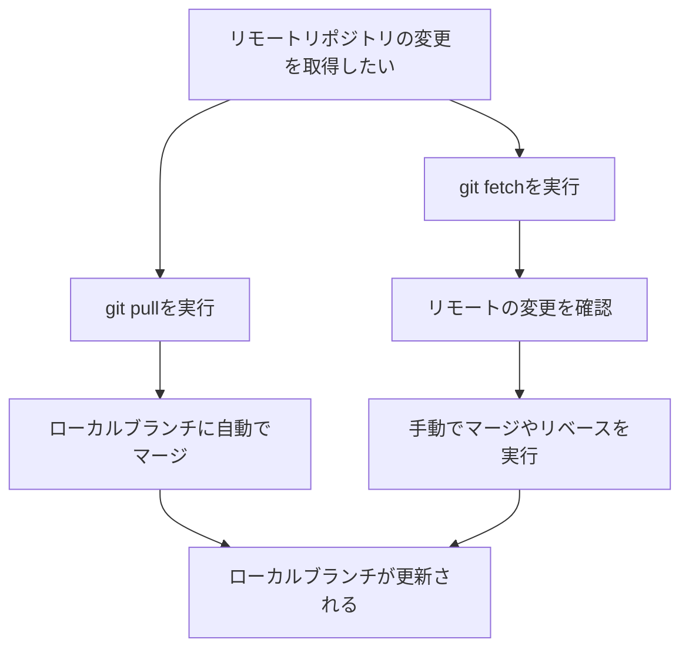

# git pull
## コマンドの概要
- **git pull**: リモートリポジトリの変更を取得し、ローカルブランチにマージします。

## コマンド例
```bash
# 現在のブランチにリモートの変更をマージ
git pull origin main

```

## オプションコマンド
- `--no-commit`: マージ後に自動でコミットしないようにします。

## 利用するケース
- チームメンバーの変更をローカルに反映させたい場合。
- リモートの最新状態をすぐにローカルに適用したい場合。


# git fetch
## コマンドの概要
- **git fetch**: リモートリポジトリの変更を取得しますが、ローカルブランチにはマージしません。

## コマンド例
```bash
# リモートリポジトリの変更を取得
git fetch origin

# すべてのリモートリポジトリから変更を取得
git fetch --all

# リモートで削除されたブランチをローカルからも削除
git fetch --prune
```

## オプションコマンド
- `--all`: すべてのリモートリポジトリから変更を取得します。
- `--prune`: リモートで削除されたブランチをローカルからも削除します。

## 利用するケース
- リモートの変更を確認したいが、ローカルブランチに影響を与えたくない場合。
- リモートの状態を確認してから手動でマージやリベースを行いたい場合。


# [備考]git pullとfetchの違い
## コマンドの概要
- **git pull**は`git fetch`と`git merge`を組み合わせたコマンドです。
- **git fetch**はリモートの変更を取得するだけで、ローカルブランチには影響を与えません。

## 利用ケースの違い
- **git pull**はローカルブランチに直接変更を適用するため、競合が発生する可能性があります。
- **git fetch**は安全にリモートの状態を確認できます。

## フローチャート
以下のフローチャートは、`git pull`と`git fetch`の動作の違いを示しています。


