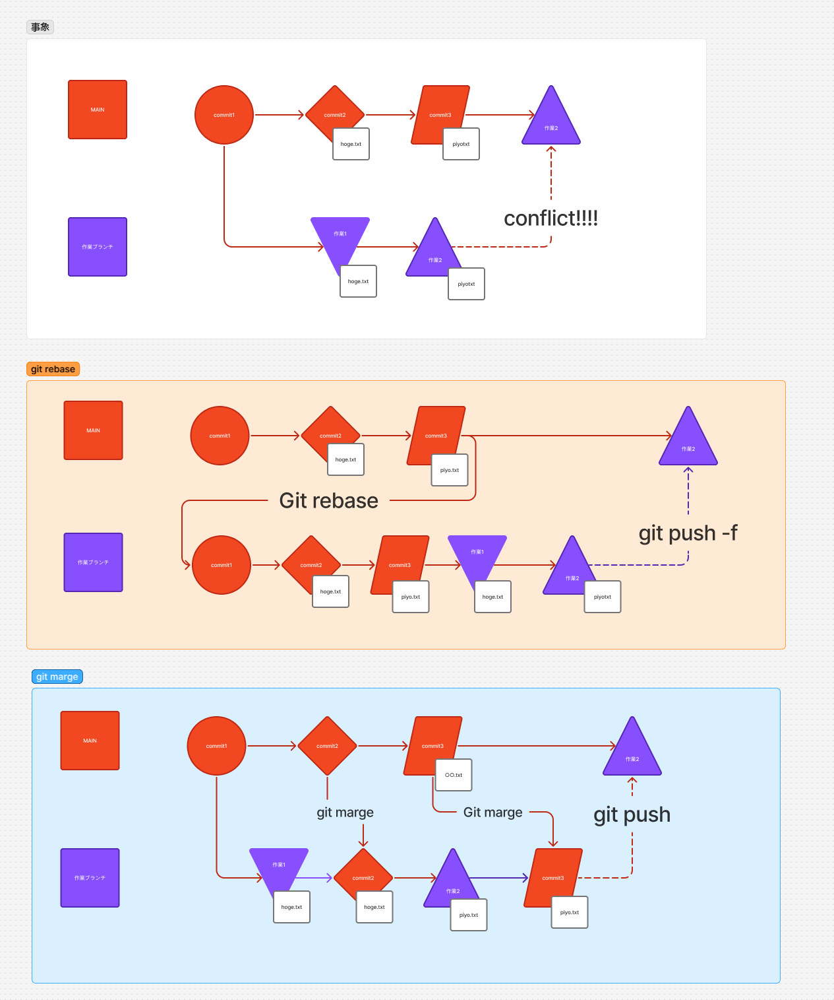

# git rebase

## コマンドの概要
- **git rebase**: ブランチの履歴を整理し、コミットを別のブランチの先頭に適用します。
  - 履歴が直線的になり、見やすくなります。

## コマンド例
```bash
# 現在のブランチを main ブランチの先頭に移動
git rebase main

# インタラクティブモードで履歴を編集
git rebase -i HEAD~3
```

## オプションコマンド
- `-i` (インタラクティブモード): コミットを編集、削除、結合するための対話型モードを提供します。
- `--onto`: 特定のブランチやコミットに対してリベースを実行します。

## 利用するケース
- 履歴を整理して、チームメンバーが理解しやすいようにしたい場合。
- 不要なコミットを削除したり、複数のコミットをまとめたい場合。

---

# git merge

## コマンドの概要
- **git merge**: 他のブランチの変更を現在のブランチに統合します。
  - 履歴をそのまま残しながら統合します。

## コマンド例
```bash
# main ブランチを現在のブランチに統合
git merge main

# マージ時にコミットメッセージを編集
git merge main --edit
```

## オプションコマンド
- `--no-ff`: マージコミットを必ず作成し、履歴を明確にします。
- `--squash`: マージする変更を1つのコミットにまとめます。

## 利用するケース
- 他のブランチの作業を統合して、機能を完成させたい場合。
- 履歴をそのまま残して、変更の流れを追跡可能にしたい場合。

---

# git merge と git rebase の違い (コンフリクト時)

## コンフリクトとは？
- **コンフリクト**: 複数のブランチで同じファイルの同じ部分が異なる内容で変更された場合に発生します。
- Git はどの変更を採用すべきか判断できないため、手動で解決する必要があります。

## git merge の場合
- **特徴**: マージ時にコンフリクトが発生すると、現在のブランチにマージ対象の変更が統合されます。
- **解決方法**:
  1. コンフリクトが発生したファイルを確認します。
  2. ファイル内の `<<<<<<<`, `=======`, `>>>>>>>` で示された部分を手動で修正します。
  3. 修正後、以下のコマンドで解決を完了します。
     ```bash
     git add <conflicted-file>
     git commit
     ```
- **履歴**: マージコミットが作成され、履歴にコンフリクト解決の記録が残ります。

## git rebase の場合
- **特徴**: リベース中にコンフリクトが発生すると、リベースが一時停止し、手動で解決する必要があります。
- **解決方法**:
  1. コンフリクトが発生したファイルを確認します。
  2. ファイル内の `<<<<<<<`, `=======`, `>>>>>>>` で示された部分を手動で修正します。
  3. 修正後、以下のコマンドでリベースを再開します。
     ```bash
     git add <conflicted-file>
     git rebase --continue
     ```
  4. 必要に応じて、さらにコンフリクトを解決します。
- **履歴**: 履歴が直線的になり、コンフリクト解決の記録は残りません。

## 違いのまとめ
| 特徴             | git merge                              | git rebase                                   |
| ---------------- | -------------------------------------- | -------------------------------------------- |
| 履歴             | マージコミットが残る                   | 履歴が直線的になる                           |
| コンフリクト解決 | マージ時に解決                         | リベース中に解決                             |
| チームでの利用   | 履歴をそのまま残したい場合に適している | 履歴を整理して見やすくしたい場合に適している |





## どちらを使うべき？
- **git merge**: 履歴をそのまま残したい場合や、チームでの作業履歴を明確にしたい場合。
- **git rebase**: 履歴を整理して、直線的で見やすい履歴を作りたい場合。

