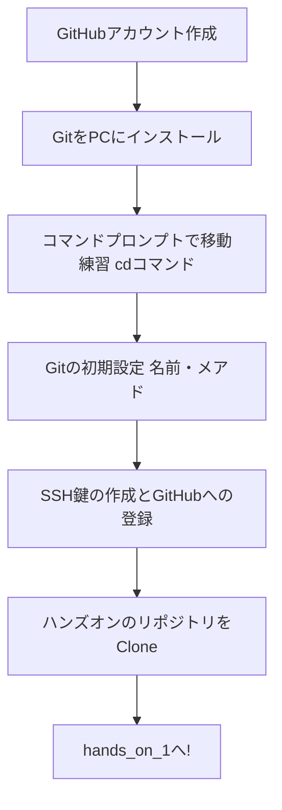

# Hands_on 0 (準備編)
このドキュメントでは、GitとGitHubを使うための「環境づくり」を丁寧に行います。<br>
エンジニアが普段使っている「黒い画面」の操作も、一つずつ解説するので安心してください。

## 1. GitHubアカウントの作成
まずは、世界中の人がプログラムを共有する場所「GitHub」に登録します。

1. GitHub公式サイトにアクセスします。
2. Sign up（登録）をクリックします。
3. 会社のメールアドレスを入力し、パスワード、ユーザー名（半角英数字）を設定します。
4. 登録したアドレスに認証メールが届くので、コードを入力してください。

## 2. Gitのインストール
次に、自分のパソコンで「記録（Git）」をつけるためのツールをインストールします。

- Windowsの方: Git for Windows から `64-bit Git for Windows Setup` をダウンロードしてインストールしてください。設定はすべて「Next（デフォルト）」のままでOKです。
- Macの方: ターミナルで `git --version` と入力してください。インストールを促す画面が出たら、そのままインストールしてください。

## 3. 「コマンドプロンプト」と「cd」コマンドを覚えよう
Gitの操作は、マウスではなく<b>コマンド（文字）</b>で行います。

### コマンドプロンプトとは？
パソコンに「フォルダを作って」「ファイルを記録して」と文字で直接命令を出す画面のことです。

- Windows: キーボードの `Winキー` を押し、出てきた検索欄に「cmd」と入力、表示された「コマンドプロンプト」をクリックして実行。
- Mac: `Command + スペース` を押し、「Terminal」と入力して実行。

### 絶対に使う3つの魔法のコマンド
まずは以下の文字を入力して、Enterキーを押す練習をしましょう。

1. `cd` (Change Directory): フォルダを移動します。
   - 例: cd Desktop（デスクトップに移動）
2. `dir` (Windows) / `ls` (Mac): 今いるフォルダの中身を表示します。
3. `mkdir` (Make Directory): 新しいフォルダを作ります。
   - 例: `mkdir git_practice`（「git_practice」というフォルダを作る）

## 4. 作業用フォルダを作ろう
ハンズオンで使うための専用フォルダをデスクトップに作ります。

1. コマンドプロンプトを開きます。
2. デスクトップに移動します。

```Bash
cd Desktop
```
3. 練習用のフォルダを作ります。

```Bash
mkdir hands-on-repo
```
4. そのフォルダの中に入ります。（※これ以降の操作はすべてこの中で行います）

```Bash
cd hands-on-repo
```

## 5. Gitの初期設定
「誰が記録したか」を登録します。これを忘れるとエラーが出ます。

```Bash
# 自分の名前（英語）
git config --global user.name "Taro Tanaka"

# 会社のメールアドレス
git config --global user.email "tanaka@example.com"
```

## 6. GitHubと自分のPCを繋ぐ（SSHの設定）
GitHubにデータを送る際、安全に通信するための「鍵」を作ります。

### ① 鍵を作るコマンドを打つ
コマンドプロンプトに以下を貼り付けます（メールアドレスは自分のものに変えてください）。

```Bash
ssh-keygen -t ed25519 -C "your_email@example.com"
```

- `Enter file in which to save the key...` → 何も入力せず `Enter`
- `Enter passphrase...` → 何も入力せず `Enter`
- `Enter same passphrase again...` → 何も入力せず `Enter`

### ② 作った「公開鍵」の中身をコピーする
以下のコマンドを打つと、暗号のような文字列が出てきます。それをすべてマウスで選択してコピーしてください。

- Windows: `type %USERPROFILE%\.ssh\id_ed25519.pub`
- Mac: `cat ~/.ssh/id_ed25519.pub`

### ③ GitHubに鍵を登録する
1. GitHubの右上にある自分のアイコンをクリックし、Settings を開きます。
2. 左メニューの SSH and GPG keys をクリック。
3. 緑色の New SSH key ボタンをクリック。
4. Titleに「My-PC」、Keyの部分に先ほどコピーした文字列を貼り付けます。
5. Add SSH key を押して完了です。

## 7. 準備完了！リポジトリをコピーしよう (Clone)
いよいよ、資料を自分のPCに取り込みます。

1. 練習用リポジトリのページに行き、緑色の [<> Code] ボタンをクリック。
2. SSH というタブを選択し、表示されたURLをコピーします。
3. コマンドプロンプトに戻り、以下のコマンドを打ちます。

```Bash
git clone {コピーしたURL}
```

4. コピーが終わったら、そのフォルダに入ります。

```Bash
cd {フォルダ名}
```
これで、`hands_on_1.md` に進む準備がすべて整いました！

---

準備編のまとめ（Mermaid図解）
