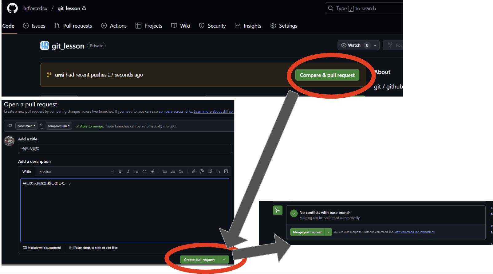

# Hands-on 1 (基本的なフローをやってみよう)

1. **新規ブランチの作成**
   自分の名前を使って新しいブランチを作成します。
   ```bash
   git branch {自分の名前}
   ```
   例:
   ```bash
   git branch mio_imada
   ```
   📌 **補足**
   - ブランチとは、作業の流れを分岐させる仕組みです。
   - 名前を付ける際は、わかりやすい名前を使いましょう。

   📖 **参考資料**
   - [git branch](./command_docs/branch_and_switch.md#git-branch)

---

2. **ブランチが作成されたか確認する**
   下記コマンドでブランチのリストが出力されます。
   ```bash
   git branch
   ```
   出力結果:
   ```
   $ git branch
   * main
     mio_imada
   ```
   📌 **補足**
   - `*`は現在のカレントブランチを示します。

---

3. **作成したブランチの切り替え**
   作成したブランチに切り替えます。
   ```bash
   git switch {作成したブランチ名}
   ```
   例:
   ```bash
   git switch mio_imada
   ```
   📖 **参考資料**
   - [git switch](./command_docs/branch_and_switch.md#git-switch)

---

4. **ルートディレクトリにあるtemplate.mdをコピー**
   自分の名前をファイル名にしてコピーします。
   ```bash
   cp ./template.md ./{自分の名前}.md
   ```
   例:
   ```bash
   cp ./template.md ./mio_imada.md
   ```

---

5. **コピーした`{自分の名前}.md`を編集**
   ファイルを開き、1行目の設問だけに回答してください。

   ⚠️ 他の設問には回答しないでください。

   例:
   ```
   1.今日の天気は？
   > 晴れ
   ```

---

6. **ステージングにあげる**
   編集したファイルをステージングに追加します。
   ```bash
   git add {自分の名前}.md
   ```
   例:
   ```bash
   git add mio_imada.md
   ```
   📖 **参考資料**
   - [git add](./command_docs/add_to_push.md#git-add)

---

7. **コミットをする**
   適当なメッセージをつけてコミットします。
   ```bash
   git commit -m '{適当なcommitメッセージ}'
   ```
   例:
   ```bash
   git commit -m '回答を追加しました'
   ```
   📖 **参考資料**
   - [git commit](./command_docs/add_to_push.md#git-commit)

---

8. **git push をする**
   作成したブランチをリモートリポジトリにプッシュします。
   ```bash
   git push origin {作成したブランチ名}
   ```
   例:
   ```bash
   git push origin mio_imada
   ```
   📖 **参考資料**
   - [git push](./command_docs/add_to_push.md#git-push)

---

9. **GitHubに移動してプルリクエスト（PR) を作成**
   GitHubの画面でプルリクエストを作成します。以下の画像を参考にしてください。
   

---

10. **完了したら柳谷に教えてください**

---

11. **OKが出たらmainにマージ**
    柳谷の確認後、mainブランチにマージします。

---

# 落ち穂拾い

### git branchの粒度は？
チームによりますが、
- 1 ブランチ=1タスク（ゴール）が基本です。
- ブランチ名は`feat/{タスク名}`がよく使われます。

---

### git commitやgit pushする頻度は？
- **git commit**は、1機能ごとに行うのが理想です。
  例:
   ```
   最終的なゴール = HPのログインページを作る
   1commit... ID入力欄の作成
   2commit... PASSWORD入力欄の作成
   3commit... 認証ボタンの作成
   ```
- **git push**は最低1日に1回行いましょう。こまめに行うと安心です。

---

[next page](hands_on_2.md)
