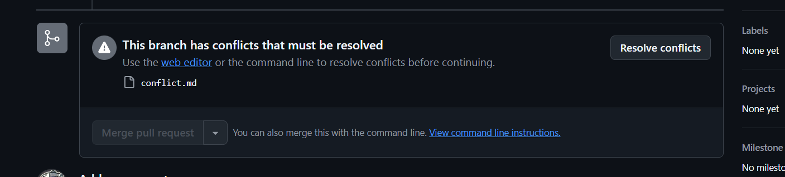
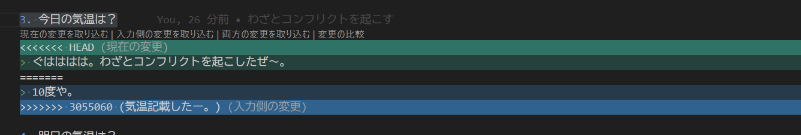
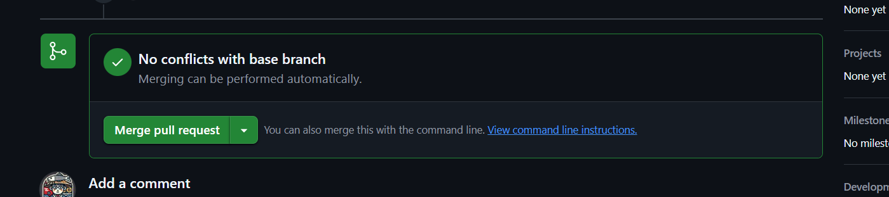

# hands on 4 (コンフリクト解消しよう)


## コンフリクトってなに？
```
コンフリクト（競合）は、Gitのようなバージョン管理システムを使用している際に、同じファイルの同じ部分を複数の人が異なる内容で変更した場合に発生する問題です。Gitはどの変更を採用すべきかを自動的に判断できないため、ユーザーが手動で解決する必要があります。
```

チーム開発をすると、コンフリクトはよく起きます。

コンフリクトが起きると若干手間なので、開発する前にチームで順次やタスクとの関係性を整理して、コンフリクトが起きないように工夫が必要です。(理想は...)

実際、チーム開発でコンフリクトはちょくちょく発生するので、発生した際に落ち着いてコンフリクトを解消できるようにしましょう。

## git rebaseとgit margeについて
これはほぼ宗教戦争なので、結論どちらもいいですが、、、
コンフリクトの解消には2つのやり方があります。

- [git rebase](../docs/command_docs/rebase_and_marge.md#git-rebase)
- [git marge](../docs/command_docs/rebase_and_marge.md#git-marge)

大きな違いcommitを取り込んだ履歴を残すか？取り込んだ履歴を残さないか？の違いです。
- git rebase = 履歴を残さない
- git marge = 履歴を残す

個人的にはgit rebaseのほうがcommit logがきれいになるので、rebase派に属していますが、自分の好きなほうを選んでください。


## 事前作業

1. 新しいブランチを作成し,ブランチを切り替える
    ```
    git switch main
    git switch -c {自身の名前}__hands_on_4
    ```

📖 **参考資料**
- [git switch -c](./command_docs/branch_and_switch.md#オプションコマンド-1)

---
2. {自分の名前}.mdの3に回答する。

    `例`
    ```
    3. 今日の気温は？
    > 10度
    ```
---
3. git add ~ git pushをする
    ```
    git add conflict.md
    git commit -m '{適当なcommitメッセージ}'
    git push origin {自身の名前}__hands_on_4
    ```
---
4. githubに遷移して、PRを作成
⚠️注意　まだmainにはmergeしない！！！（理由：みなさんのPRに私がわざとconflictを起こす作業をするため）


---
5. PRが作成完了したら、柳谷に教えてください。
---
## コンフリクトを解消しよう。(柳谷が大好きなgit rebase編)


1. github PR画面がこんな感じになっているか確認


---
### なんでコンフリクトになってるの？

   * merge先のmainブランチにある同じファイルを私が修正したから


---
2. mainの最新のcommitを取り込む
    ```
    git pull origin main
    ```
---
3. 先ほどの作業ブランチ（ {自身の名前}__hands_on_4)に切り替える
    ```
    git switch  {自身の名前}__hands_on_4
    ```

---
4. git rebase を行う
    ```
    git rebase main
    ```

    そうすると下記のような回答が帰ってきます。

    ```
    ╰─ git rebase main
    Auto-merging umi.md
    CONFLICT (content): Merge conflict in  {自分の名前}.md
    error: could not apply 3055060... ｘｘｘｘｘｘｘｘ
    hint: Resolve all conflicts manually, mark them as resolved with
    hint: "git add/rm <conflicted_files>", then run "git rebase --continue".
    hint: You can instead skip this commit: run "git rebase --skip".
    hint: To abort and get back to the state before "git rebase", run "git rebase --abort".
    Could not apply 3055060... ｘｘｘｘｘｘｘｘｘｘ

    ```

---
5.  {自分の名前}.mdのconflictを修正
{自分の名前}.mdを開くと下記のような記載になっています。


    ```
    3. 今日の気温は？
    <<<<<< HEAD
    > ぐはははは。わざとコンフリクトを起こしたぜ～。  -> ターゲットブランチ（main)の状態
    =======
    > 10度や。 --> 現在のブランチの状態
    >>>>>>　xxxx
    ```
    これ正しい内容に修正する。修正する時に`>>>`や`<<<`, `===`などの区切り文字は削除する。
    ```
    3. 今日の気温は？
    > 10度や。
    ```
---
6. 修正したらステージングに上げる
    ```
    git add {自分の名前}.md
    ```
---
7. 再度git rebase を行い問題ないか確認する
    ```
    git rebase --continue
    ```
---
8. たぶんvimが立ち上がるので、`:wq`で閉じる
結果：下記のように結果が帰ってくればOK
    ```
    ╰─ git rebase --continue
    [detached HEAD e5f25c3] 気温記載したー。
    3 files changed, 51 insertions(+), 4 deletions(-)
    create mode 100644 docs/images/conflict_file_image.png
    Successfully rebased and updated refs/heads/umi__hands_on_4.
    ```
---
9. conflict修正した内容を再度PUSHする
その際に過去commitが異なっているので、forcepush(--force-with-lease)が必要です。
    ```
    git push --force-with-lease origin {自身の名前}__hands_on_4
    ```
---

📖 **参考資料**
- [git push](./command_docs/add_to_push.md#git-push)


10. githubを確認して、PRのconflictが解消されているか確認
⚠️注意　まだmainにはmergeしない！！！


---
## コンフリクトを解消しよう。(柳谷が嫌いなgit marge編)

1. コンフリクト状態になっているか確認

    柳谷が上記git rebaseで利用した内容を再度conflict化します。
      
---
2. ローカルのターゲットブランチに移動する
    ```
    git switch main
    ```
---
3. 最新のcommitを取り込む
    ```
    git pull origin main
    ```
---
4. ターゲットブランチに切り替える
   ```
   git switch {自身の名前}__hands_on_4
   ```

---
5. ターゲットブランチの最新のcommitを作業ブランチに取り込む
    ```
      git merge main
    ```
---
6.  {自分の名前}.mdのconflictを修正
{自分の名前}.mdを開くと下記のような記載になっています。


    ```
      3. 今日の気温は？
      <<<<<< HEAD
      > ぐはははは。わざとコンフリクトを起こしたぜ～。  -> ターゲットブランチ（main)の状態
      =======
      > 10度や。 --> 現在のブランチの状態
      >>>>>>　xxxx
    ```

    これ正しい内容に修正する。修正する時に`>>>`や`<<<`, `===`などの区切り文字は削除する。

      ```
      3. 今日の気温は？
      > 10度や。
      ```
---
7. ステージングに上げる
    ```
    git add {自分の名前}.md
    ```
---
8. git commitをする
   ```
    git commit -m 'コンフリクト修正'
   ```
---
9. Githubにpushする

    ```
    git push origin {自身の名前}__hands_on_4
    ```
---
10. githubを確認して、PRのconflictが解消されているか確認


---
[next page](./hands_on_5.md)
