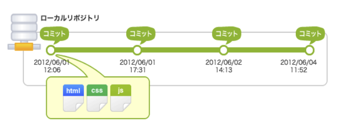
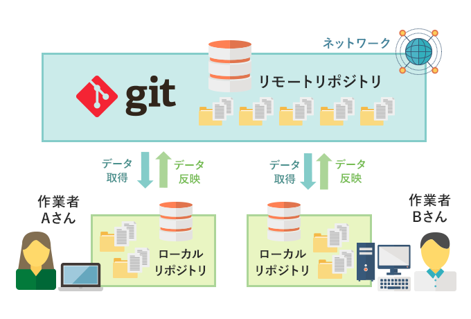
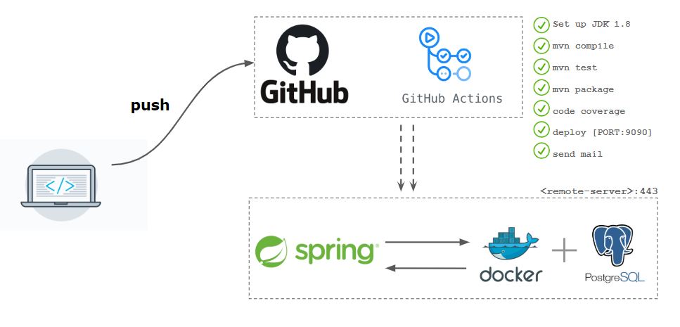

# 概要
## そもそもなぜ、gitを利用して開発するの？
#### **1. バックアップが簡単に取れる**
- Gitを使うと、ファイルの変更履歴をすべて記録できます。
- 例えば、「昨日の状態に戻したい！」と思ったときに、簡単に過去の状態に戻すことができます。
- これにより、誤ってファイルを壊してしまった場合でも安心です。

#### **2. 複数人で同時に作業ができる**
- Gitは「分散型バージョン管理システム」と呼ばれ、複数のエンジニアが同じプロジェクトで同時に作業できます。
- 例えば、Aさんが「デザインを変更」し、Bさんが「新しい機能を追加」しても、それぞれの作業を別々に管理できます。
- 最終的に、これらの変更を1つにまとめることも簡単です。

  

#### **3. Gitにpushするだけで、自動的にサーバーにデプロイすることができる。**
- Github acitonsを利用してCI/CDを実行可能。Gitにpushすればコードを自動的にサーバーにデプロイすることが可能。

### **まとめ**
Gitを使うことで、以下のようなメリットがあります：
1. **安心感**：過去の状態に戻せる。
2. **効率化**：複数人で同時に作業できる。
3. **整理整頓**：作業内容を分けて管理できる。
4. **共有**：チームで簡単に作業を共有できる。
5. **自動化**：作業を効率化し、ミスを防げる。

初心者の方でも、まずは「過去に戻れる」「みんなで作業できる」という2点を意識して使い始めるといいと思いますー。

## GitとGithubって違うもの？
### 簡単に言うと、Gitはツールであり、GitHubはそのツールを活用するためのプラットフォームです。
- Git
  - ツールの名前です。ローカル環境でコードの変更履歴を管理し、ブランチを作成して並行作業を行うことができます。Git自体はコマンドラインツールであり、リポジトリの操作（コミット、マージ、プッシュなど）を行います。

- GitHub
  -  プラットフォームの名前です。Gitリポジトリをホスティングするためのクラウドサービスです。Gitを利用してローカルで管理しているリポジトリをリモートで共有したり、チームでのコラボレーションを容易にするための機能（プルリクエスト、コードレビュー、Issue管理など）を提供します。
  -  同じようなプラットフォームでgitlabなどが存在します。

## 事前に知っていてほしい用語
- リポジトリ
  - 簡単にいうとGitで管理されているフォルダーのこと
- リモートリポジトリ
  - Githubなどのクラウド上にあるフォルダーのことです。
- ローカルリポジトリ
  - リモートリポジトリをローカルPCにあるフォルダーのことです。

---

[NEXT PAGE](1_setup.md)
