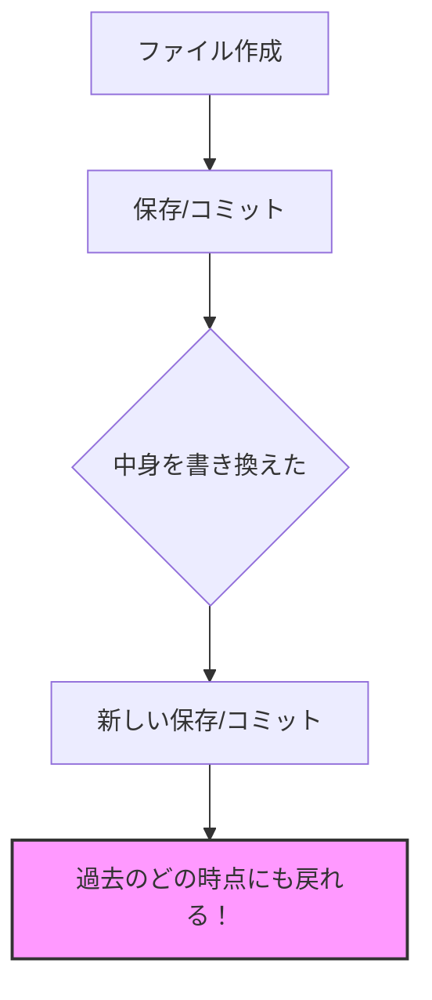
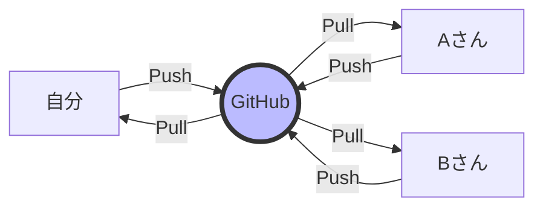
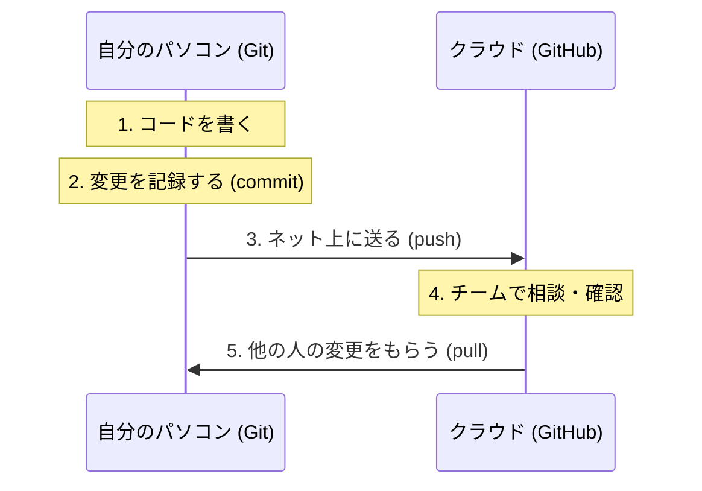

# Git と GitHub の違いを知ろう！
「Git」と「GitHub」は名前が似ていますが、役割は全く違います。
この資料では、初心者の方に向けてその違いをわかりやすく解説します。

## 1. 一言でいうと？
まずは、一番大きな違いをイメージで掴みましょう。

| サービス名 | 役割 | イメージ |
|---|---|---|
| Git | 自分のパソコン内での 「記録係」 | 自分のノート（オフライン） |
| GitHub | ネット上にある 「共有スペース」 | みんなで見れる掲示板（オンライン） |

## 2. Git とは？（ローカルの管理）
Gitは、ファイルの「変更履歴」を保存するためのツールです。 
「昨日の状態に戻したい！」「誰がどこを変えたか知りたい！」という要望を叶えてくれます。

- 自分のPC内だけで完結します。
- インターネットがなくても使えます。
- 「いつ」「誰が」「何を」変えたかを細かく記録します。

## 3. GitHub とは？（クラウドでの共有）
GitHubは、Gitで作った記録をネット上にアップロードして、世界中の人と共有できるサービスです。

- インターネット上の置き場所です。
- 他の人のコードを見たり、自分のコードを送ったりできます。
- 「プルリクエスト（PR）」という機能で、チームメンバーにコードのチェックを依頼できます。

## 4. 実際の作業の流れ（連携）
普段の仕事では、GitとGitHubを以下のようにセットで使います。

- Git で自分の作業をこまめに記録する。
- 区切りが良いところで GitHub にアップロードして共有する。
- GitHub から他の人の作業を受け取って自分の Git を最新にする。

## 5. まとめ
- <b>Git は 「ツール（道具）」。</b> ファイルのバージョンを管理するもの。
- <b>GitHub は 「プラットフォーム（場所）」。</b> Gitの記録をみんなで見られるようにするもの。

<b>「Git（道具）を使って、GitHub（場所）でみんなと協力する」</b> と覚えれば完璧です！

---

💡 豆知識：Git以外の「GitHub」みたいな場所実はGitHub以外にも、Gitの記録を共有するサービスはあります。

- GitLab: 企業が自前で立てることが多い
- Bitbucket: アトラシアン社（Jiraなど）のサービス

どれを使っても、手元で使う Git の操作はほとんど同じですよ！